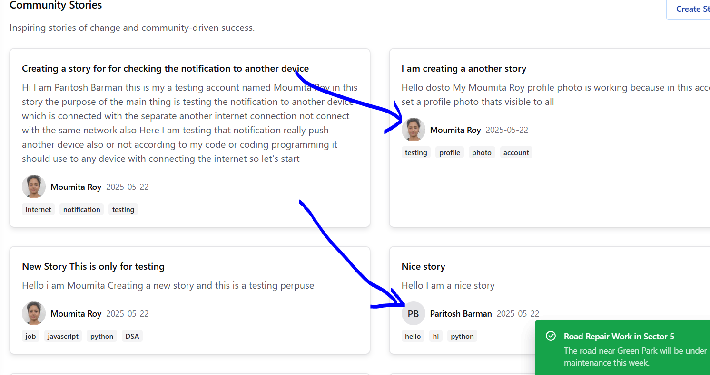
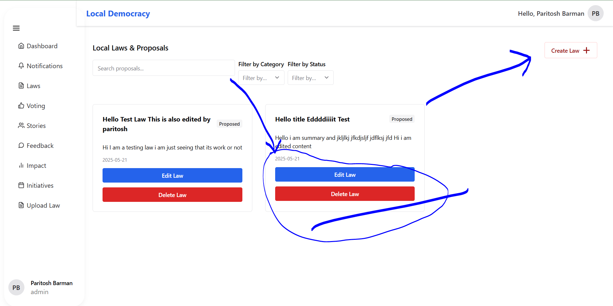

# Local Democracy Engagement Platform

> **Submission** by *Paritosh Barman*

A solo-built full-stack web application designed to **strengthen civic engagement** by making local government accessible, interactive, and impactful for citizens.

---

## Problem Statement

Local civic engagement is declining due to lack of transparency, accessibility, and real-time interaction between the government and citizens. This platform addresses that gap by offering:

- Real-time alerts on local issues
- Easy-to-understand summaries of local policies
- Direct public feedback channels to representatives
- Community-based voting on civic concerns
- Visualization of the policy impact on neighborhoods
- Tools to start and track community initiatives

---

## Solution Overview

This application directly addresses each point in the problem statement through the following modules:

### ✅ Real-time Notifications  
Citizens receive automatic alerts (every 5 seconds for demo) about local issues like water cuts, electricity outages, community events, etc., via WebSockets.

- **Tech Used:** `Socket.IO`, `Node.js`, `React`, `Redux`
- **Example Notifications:** Road repairs, vaccination drives, community meetings, etc.

### ✅ Plain Language Legislation Summaries (Stories Page)  
Civic legislation is broken down into easy-to-read “story cards” to help users understand what's being proposed in their area.

- **UI Elements:** Chakra UI cards, categorized by type (infrastructure, public safety, etc.)

### ✅ Feedback System  
Users can submit suggestions, complaints, or feedback for local representatives, simulating a public communication loop.

- **Planned Extension:** Admin portal for reps to publicly respond and track resolutions.

### ✅ Community Voting  
Voting interface where citizens can express opinions on current proposals or local decisions. Results can be viewed in real-time.

- **Aggregate system:** Votes stored and visualized on a results page.

### ✅ Policy Impact Visualization  
Dedicated section to highlight how passed policies have affected the community — currently shows static data, future updates will support dynamic impact charts.

### ✅ Initiatives  
Citizens can view or start local initiatives like cleanliness drives, awareness events, and street maintenance efforts.

---

### 🔐 Authentication & Roles  
Secure access with user roles (Admin, Normal User) and protected routes based on permissions.

- **Tech Stack:** `JWT`, `Role-based Middleware` (backend + frontend)
- **Credentials for Testing:**
  - 👤 **User**: `moumita@gmail.com` / `123`
  - 🛠️ **Admin**: `pariadmin@gmail.com` / `123`


## 🧰 Technology Stack

| Layer           | Tools/Technologies Used                                                                 |
|------------------|-----------------------------------------------------------------------------------------|
| **Frontend**     | React.js, Chakra UI, Redux Toolkit, React Router, Vite, Axios                          |
| **Backend**      | Node.js, Express.js, Socket.IO, Multer (for file uploads), JWT Auth                    |
| **Database**     | MongoDB with Mongoose (used for relational-like references across models)              |
| **State Management** | Redux Toolkit, React Context                                                       |
| **Authentication** | JWT (JSON Web Tokens), Middleware-based Role Protection                              |
| **Real-Time**     | Socket.IO for pushing notifications in real-time                                      |
| **File Upload**   | Multer (in Node.js backend) + Local storage (uploads folder)                          |
| **Styling**       | Chakra UI, Custom CSS                                                                 |
| **Routing (Frontend)** | React Router DOM                                                               |
| **Routing (Backend)** | Express Router (Modular routes: /auth, /laws, /votes, etc.)                      |
| **Form Handling** | React Hook Form / Controlled Components                                               |
| **Development Tools** | ESLint, Prettier, Vite, Nodemon, Postman                                          |
| **Hosting & Deployment** | Netlify (Frontend), Render (Backend), MongoDB Atlas (Cloud DB)               |
| **Version Control** | Git, GitHub                                                                          |
| **Testing**        | Manual Testing with test credentials (admin/user)                                     |
| **Security**       | CORS, Password Hashing (bcrypt)                                               |

---

## Folder Structure

```
|____local_democracy_backend
| |____.env
| |____.gitignore
| |____app.js
| |____config
| | |____db.js
| |____controllers
| | |____authController.js
| | |____feedbackController.js
| | |____impactController.js
| | |____initiativeController.js
| | |____lawController.js
| | |____notificationController.js
| | |____storyController.js
| | |____voteController.js
| |____index.js
| |____indexPast.js
| |____middlewares
| | |____authMiddleware.js
| | |____roleMiddleware.js
| | |____uploadMiddleware.js
| |____models
| | |____blacklistModel.js
| | |____feedbackModel.js
| | |____impactModel.js
| | |____initiativeModel.js
| | |____lawModel.js
| | |____notificationModel.js
| | |____storyModel.js
| | |____userModel.js
| | |____voteModel.js
| |____node_modules
| |____package-lock.json
| |____package.json
| |____README.md
| |____routes
| | |____authRoutes.js
| | |____feedbackRoutes.js
| | |____impactRoutes.js
| | |____initiativeRoutes.js
| | |____lawRoutes.js
| | |____notificationRoutes.js
| | |____storyRoutes.js
| | |____voteRoutes.js
| |____sockets
| | |____notificationSocket.js
| |____uploads
| | |____1747741685633-Moumita Roy.jpeg
| | |____1747742592518-Moumita Roy.jpeg
| |____utils
| | |____notificationData.js
|____local_democracy_frontend
| |____.env
| |____.gitignore
| |____dist
| |____eslint.config.js
| |____index.html
| |____jsconfig.json
| |____node_modules
| |____package-lock.json
| |____package.json
| |____public
| | |____vite.svg
| | |_____redirects
| |____README.md
| |____src
| | |____App.css
| | |____App.jsx
| | |____assets
| | | |____react.svg
| | |____components
| | | |____AllRouter.jsx
| | | |____FilterBar.jsx
| | | |____Header.jsx
| | | |____Nav.jsx
| | | |____NotificationComponent.jsx
| | | |____ProtectedRoute.jsx
| | | |____RoleBaseDisplay.jsx
| | | |____RoleBaseProtectedRoute.jsx
| | | |____Sidebar.jsx
| | | |____StoryDialog.jsx
| | | |____Test.jsx
| | | |____ui
| | | | |____color-mode.jsx
| | | | |____provider.jsx
| | | | |____toaster.jsx
| | | | |____tooltip.jsx
| | | |____VotingDialog.jsx
| | |____index.css
| | |____main.jsx
| | |____MainLayout.jsx
| | |____pages
| | | |____Dashboard.jsx
| | | |____EditLaw.jsx
| | | |____Feedback.jsx
| | | |____Impact.jsx
| | | |____Initiatives.jsx
| | | |____Laws.jsx
| | | |____LoginPage.jsx
| | | |____Notifications.jsx
| | | |____RegisterPage.jsx
| | | |____Stories.jsx
| | | |____UploadLaw.jsx
| | | |____Voting.jsx
| | | |____VotingPage.jsx
| | |____redux
| | | |____notificationsReducer.js
| | | |____store.js
| | | |____userReducer.js
| |____vite.config.js
|____README.md
```

---

## Setup Instructions

1. **Clone the Repository**

```bash
git clone https://github.com/ParitoshBarman/Local-Democracy-Platform.git

```

2. **Start the Backend**

```bash
cd local_democracy_backend
npm install
node index.js
    or
npm run dev
```

3. **Start the Frontend**

```bash
cd local_democracy_frontend
npm install
npm run dev
```

Allow CORS correctly.

---

## Live Demo

- **Frontend:** [Netlify Deployment](https://local-democracy-platform.netlify.app)
- **Backend (WebSocket):** [Render Deployment](https://local-democracy-platform.onrender.com)
- **Frontend GitHub:** [Frontend GitHub Link](https://github.com/ParitoshBarman/Local-Democracy-Platform/tree/master/local_democracy_frontend)
- **Backend GitHub:** [Backend GitHub Link](https://github.com/ParitoshBarman/Local-Democracy-Platform/tree/master/local_democracy_backend)
<!-- - **Video:** [Video Link](https://drive.google.com/file/d/1g-sNa-HbtS9PZqIehDzRT3V7smCz6j72/view?usp=drivesdk) -->

---


## 🔐 Test Credentials

You can use the following credentials to log in and explore the application:

### 👤 Normal User
- **Email:** moumita@gmail.com
- **Password:** 123
Moumita Roy is just for testing user with a demo profile image

### 🛠️ Admin User
- **Email:** pariadmin@gmail.com
- **Password:** 123


## 📷 Screenshots

> Added some UI screenshots of:
- Dashboard
- Voting Dialog
- Story Dialog
- Notification Popup
- Role-based route behavior


### 🧑‍💻 Normal User View

---

### 🔐 Log In Page  


### 📝 Register Page  


### 🏠 Dashboard  


### 🔔 Notifications  


### 📜 Laws  


### 🗳️ Voting  


### 💬 Feedback  


### 📈 Impact  


### 🧾 Stories  


### 🌱 Initiatives  


### 👨‍🎨 Created By Section  


---

### 🛡️ Admin View – Extra Features

---

### 📋 Admin Sidebar  


### ✏️ Create, Edit & Delete Options  


### 🗳️ Vote Creation Panel  


---

## Author

**Paritosh Barman**  

