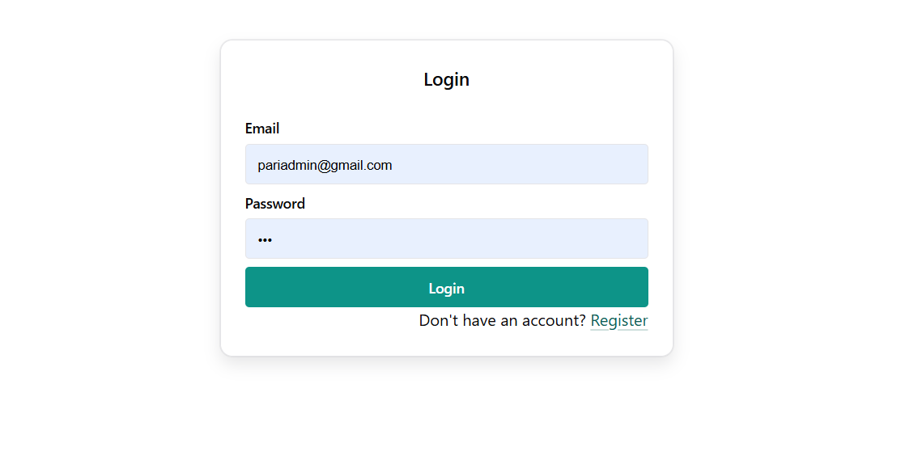
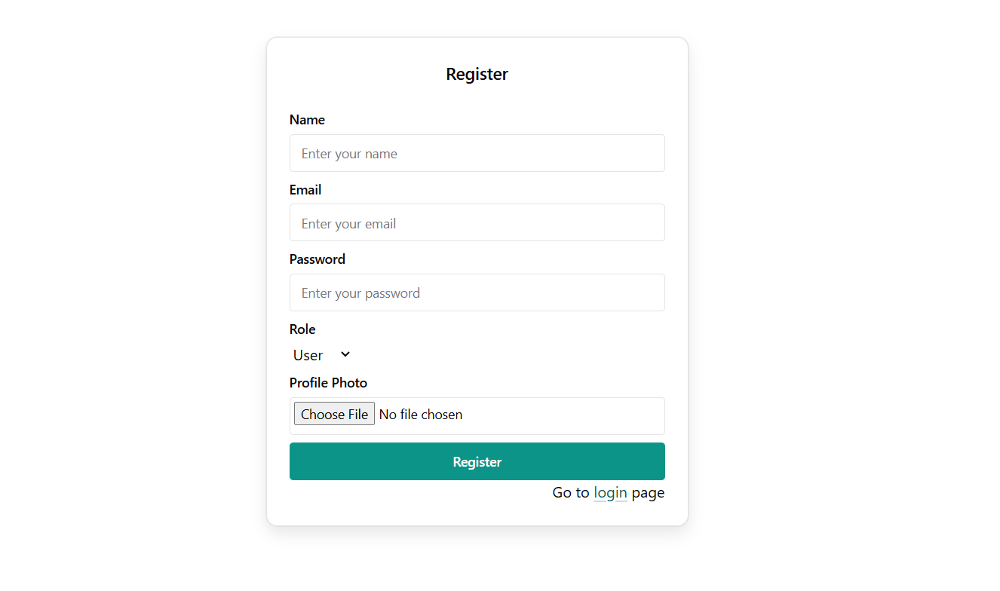
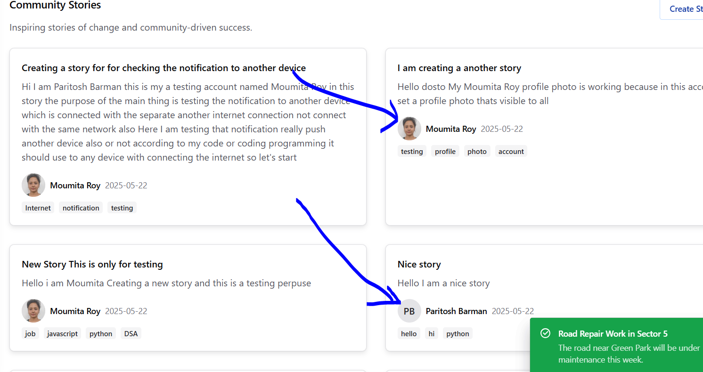
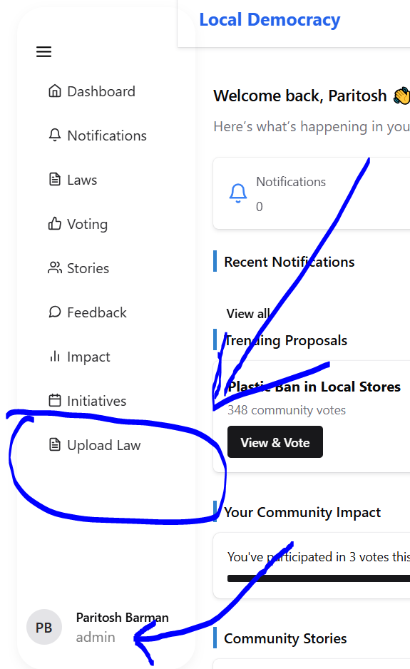
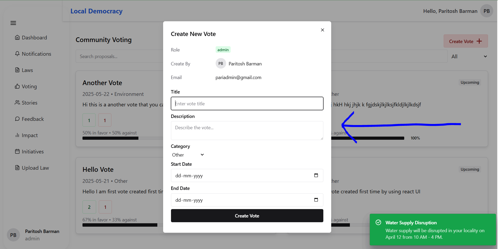

# 🌐 React Role-Based Portal

This is a fully functional role-based dashboard portal built using **React + Vite**, featuring authentication, story and voting modules, and a responsive UI powered by **Chakra UI**.

---

## 🚀 Features

- 🔐 JWT-based authentication
- ⚙️ Role-based protected routes
- 🗳️ Voting and story creation dialogs
- 🔄 Live notifications with Socket.io
- 🌗 Chakra UI theming and color mode
- 🧠 Debounced search
- ⚛️ State management with Redux Toolkit
- 🧩 Modular and scalable folder structure
- 📝 Editable laws, feedback, and impact sections

---

## 🧱 Tech Stack

| Tech             | Description                      |
|------------------|----------------------------------|
| React (Vite)     | Frontend framework               |
| Chakra UI        | Component library + styling      |
| Redux Toolkit    | State management                 |
| Axios            | HTTP client                      |
| Socket.io-client | Real-time communication          |
| JWT              | Auth token-based security        |

---

## 📁 Project Structure

```
.
├── .env                  # Environment variables
├── index.html            # Vite HTML entry
├── package.json          # Project config
├── public/               # Static assets
├── src/
│   ├── assets/           # Images & icons
│   ├── components/       # Reusable UI components
│   ├── pages/            # Route-based pages
│   ├── redux/            # Redux store & slices
│   ├── App.jsx           # App wrapper
│   ├── main.jsx          # Entry point
│   └── MainLayout.jsx    # Layout wrapper
```

---

## 📦 Installation

```bash
git clone <repo-link>
cd local_democracy_frontend
npm install
```

---

## 🧪 Run Locally

```bash
# Start development server
npm run dev
```

---

## 🔐 Environment Variables

Create a `.env` file in the root and configure the following:

```env
VITE_API_BASE_URL=http://localhost:5000/api
VITE_API_IMAGE_URL=http://localhost:5000/uploads/
```

## ⚙️ Environment Variables

The project uses the following environment variables (example from `.env`):

```env
VITE_API_BASE_URL=https://local-democracy-platform.onrender.com/api
VITE_API_IMAGE_URL=https://local-democracy-platform.onrender.com
VITE_API_NOTIFICATION_SOCKET_URL=https://local-democracy-platform.onrender.com
```


---

## 🧠 Redux Store

Redux is used to manage:

- User authentication
- Notifications (via Socket.io)
- Dynamic role-based display logic

State slices are located in:  
`/src/redux/userReducer.js`  
`/src/redux/notificationsReducer.js`

---

## 🛠️ Key Components

| Component                | Description                             |
|--------------------------|-----------------------------------------|
| `StoryDialog.jsx`        | Dialog to create new stories            |
| `VotingDialog.jsx`       | Dialog to initiate new voting           |
| `RoleBaseDisplay.jsx`    | Show/hide elements by user role         |
| `ProtectedRoute.jsx`     | Authenticated route protection          |
| `RoleBaseProtectedRoute.jsx` | Route protection based on roles     |
| `toaster.jsx`            | Global toast messages with Chakra UI    |
| `NotificationComponent.jsx` | Real-time notification popups       |

---

## 🔐 Auth Flow

- Users log in to get a JWT token
- The token is stored in Redux
- Axios includes the token in the `Authorization` header
- Protected routes & dialogs check `userState.user.role`

---

## 🧪 Debounced Search

Used for live filtering (e.g. laws, stories, etc.)

```js
const debounce = (func, delay) => {
  let timeout;
  return (...args) => {
    clearTimeout(timeout);
    timeout = setTimeout(() => func(...args), delay);
  };
};
```

---


## 🔐 Test Credentials

You can use the following credentials to log in and explore the application:

### 👤 Normal User
- **Email:** moumita@gmail.com
- **Password:** 123

### 🛠️ Admin User
- **Email:** pariadmin@gmail.com
- **Password:** 123


## 📷 Screenshots

> Added some UI screenshots of:
- Dashboard
- Voting Dialog
- Story Dialog
- Notification Popup
- Role-based route behavior


### 🧑‍💻 Normal User View

---

### 🔐 Log In Page  


### 📝 Register Page  


### 🏠 Dashboard  


### 🔔 Notifications  


### 📜 Laws  


### 🗳️ Voting  


### 💬 Feedback  


### 📈 Impact  


### 🧾 Stories  


### 🌱 Initiatives  


### 👨‍🎨 Created By Section  


---

### 🛡️ Admin View – Extra Features

---

### 📋 Admin Sidebar  


### ✏️ Create, Edit & Delete Options  


### 🗳️ Vote Creation Panel  



## 🌐 Live Demo

Access the app here: [Local Democracy Platform](https://local-democracy-platform.netlify.app/login)


---
## 👨‍💻 Author

Developed by **Paritosh Barman**  
🔗 [Portfolio](https://thunderous-zuccutto-94f498.netlify.app/)  
✉️ paritoshpuitta@gmail.com

---